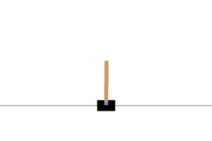
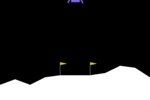
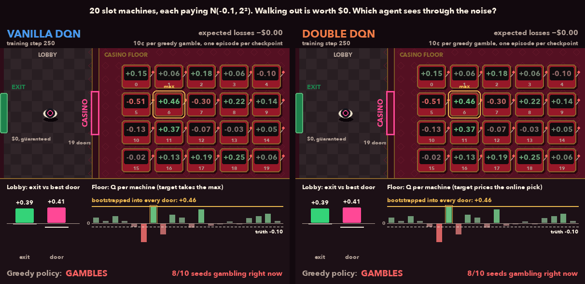
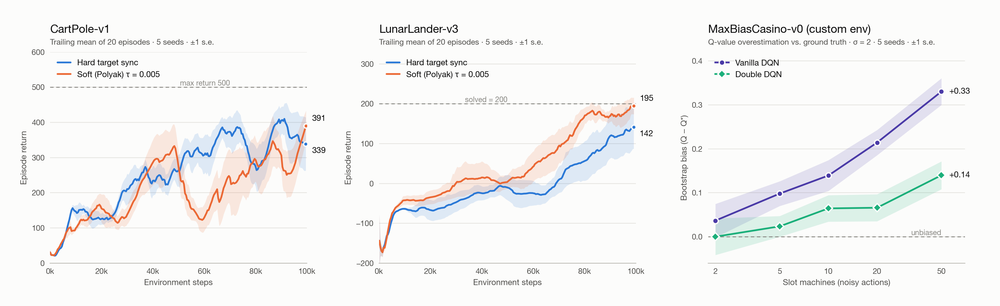

# Deep Q-Networks from scratch

<p align="center">
  
  
  
</p>
<p align="center"><sub><b>CartPole-v1</b> · <b>LunarLander-v3</b> · <b>MaxBiasCasino-v0</b> (vanilla DQN vs Double DQN)</sub></p>

A from-scratch PyTorch implementation of DQN, with soft (Polyak) target updates and
Double DQN, benchmarked across three environments over multiple seeds with statistical
tests. One of the three is a custom environment where the true Q-values are known.

## TL;DR

```bash
python -m venv .venv && source .venv/bin/activate
pip install -e '.[render]'
python -m dqn.train --total-steps 100000 --target-update-mode soft --tau 0.005   # ~1 min on CPU
python -m dqn.evaluate --episodes 20    # greedy vs random score, GIF at results/median_episode.gif
```

## Setup

```bash
python -m venv .venv && source .venv/bin/activate
pip install -e '.[dev,render]'     # core + tests + CartPole rendering
pip install swig && pip install -e '.[box2d]'   # LunarLander
pip install -e '.[casino]'         # pygame-ce, to render the casino
pytest                             # 139 tests
```

Requires Python 3.10+. Training runs on CPU. Each 100k-step run takes about a minute on a laptop.

## CartPole-v1

```bash
# One agent
python -m dqn.train --total-steps 100000 --target-update-mode soft --tau 0.005

# Full 5-seed experiment: hard vs soft targets
python -m dqn.train --total-steps 100000 --target-update-mode hard             --seeds 0 1 2 3 4 --output-dir outputs/hard
python -m dqn.train --total-steps 100000 --target-update-mode soft --tau 0.005 --seeds 0 1 2 3 4 --output-dir outputs/soft
python -m dqn.compare --a outputs/hard --b outputs/soft --labels "hard targets" "soft targets"

# Greedy evaluation + a GIF of the median episode
python -m dqn.evaluate --checkpoint outputs/soft/dqn_seed1.pt --episodes 50 --gif results/cartpole_win.gif
```

Add `--double` to any `dqn.train` call to switch to Double DQN targets. It composes with both
target-update modes.

## LunarLander-v3

The same agent and the same code run unchanged. Only `--env` changes.

```bash
python -m dqn.train --env LunarLander-v3 --total-steps 100000 --target-update-mode hard             --seeds 0 1 2 3 4 --output-dir outputs/lunar
python -m dqn.train --env LunarLander-v3 --total-steps 100000 --target-update-mode soft --tau 0.005 --seeds 0 1 2 3 4 --output-dir outputs/lunar-soft
python -m dqn.compare --a outputs/lunar --b outputs/lunar-soft --labels "hard targets" "soft targets" \
    --output results/lunar_hard_vs_soft.png

python -m dqn.evaluate --checkpoint outputs/lunar-soft/dqn_seed4.pt --episodes 50 --gif results/lunar_win_soft.gif
```

To log overestimation directly while training, pass `--overestimation-every 5000`. This records
predicted Q against the realised discounted return, as in van Hasselt et al. 2016, Fig. 3.
Summarise the logs with `python -m dqn.overestimation --a <vanilla dir> --b <double dir>`.

## MaxBiasCasino-v0

A custom Gymnasium environment (`src/dqn/casino_env.py`) based on Sutton & Barto's
Example 6.7. In the lobby, the agent can walk out for $0 or enter a casino. Inside, every
slot machine pays `N(−0.1, σ²)`, so every machine loses money on average and walking out
is optimal. Vanilla DQN prices the casino with a `max` over noisy estimates. Once that max
rises above zero, gambling looks profitable. Because the true Q-values are known exactly,
the bias can be measured directly instead of inferred from return curves.

```bash
python -m dqn.casino_experiment                               # 10 seeds × {vanilla, double}, bias plot + duel GIF
python -m dqn.casino_experiment --sweep --seeds 0 1 2 3 4     # bias over n_machines × σ grid
```

```python
import gymnasium as gym
import dqn.casino_env                                         # registers MaxBiasCasino-v0
env = gym.make("MaxBiasCasino-v0", n_actions=20, sigma=2.0, render_mode="rgb_array")
```

## Summary of Implementation

- **The core algorithm is written from first principles** in PyTorch: replay buffer,
  epsilon-greedy acting, Bellman targets with terminal masking, Huber loss with
  gradient clipping, and a lagged target network. No RL library is used.
- **Two extensions on top:** soft (Polyak) target updates
  (`θ⁻ ← τθ + (1−τ)θ⁻`, written in place under `no_grad`) and **Double DQN**, which
  splits action selection (online net) from action evaluation (target net).
- **Solves CartPole and LunarLander.** The best CartPole policy scores **500.0 ± 0.0**
  (a perfect score) over 50 greedy episodes. The best LunarLander policy scores
  **215.8** against a random baseline of −155.
- **Soft targets finished ahead on both environments** and had lower variance across seeds.
  On LunarLander, all 5 soft-target seeds cleared a 195 trailing mean, against 3 of 5 with hard targets.
- **Double DQN removes about two thirds of the overestimation bias** on
  `MaxBiasCasino-v0`, a custom Gymnasium environment built so the bias can be measured
  against the exact true Q-values.
- **Experiments are run like experiments:** 5–10 seeds per arm, curves resampled
  onto a shared environment-step grid, ±1 s.e. ribbons, Welch's t-tests, and 139 tests
  in `pytest`.

## Results



<sub>Regenerate with `python -m dqn.results_figure`.</sub>

**Target-network updates** (5 seeds per arm, 100k environment steps, final 20-episode trailing mean ± s.e.):

| Environment | Hard sync (every 500 steps) | Soft / Polyak (τ = 0.005) | Best greedy policy (50 episodes) |
|---|---:|---:|---:|
| CartPole-v1 | 338 ± 76 | **394 ± 42** | **500.0 ± 0.0** (random: 20.9) |
| LunarLander-v3 | 145 ± 53 | **193 ± 24** | **215.8** (random: −155.1) |

Soft updates finished ahead on both environments, with roughly half the seed-to-seed spread.
All 5 soft seeds on LunarLander cleared a 195 trailing mean. With hard targets, 3 of 5 did.
With 5 seeds, Welch's t-test does not yet call the gap in final return significant
(p = 0.54 on CartPole, p = 0.44 on LunarLander). `dqn.compare` prints these tests next to
every comparison.

**Overestimation bias** on `MaxBiasCasino-v0` (20 machines, σ = 2, 10 seeds, second half of training):

| | Bootstrap bias vs ground truth | Greedy agent gambles |
|---|---:|---:|
| Vanilla DQN | +0.219 ± 0.021 | 97% ± 2% |
| Double DQN | **+0.077 ± 0.021** | **52% ± 10%** |

Double DQN cuts the bias by half to three quarters at every machine count in the σ = 2 sweep, and
the gap widens as the action count grows (right panel). It does not reach zero. Both networks
are fit to the same replay buffer, so they share its sampling error. When both pick the same
lucky machine, the decoupling in Double DQN has nothing to cancel.

<details>
<summary>Project layout</summary>

```
src/dqn/
  replay_buffer.py      fixed-capacity FIFO replay + typed Batch contract
  agent.py              epsilon-greedy acting, hard + soft (Polyak) target updates
  learning.py           vanilla + Double DQN targets, Huber loss, optimisation step
  network.py            QNetwork MLP
  train.py / evaluate.py   training loop, greedy evaluation, GIF capture (CLIs)
  compare.py / stats.py    multi-seed comparison, seed aggregation, Welch's t-test
  overestimation.py     predicted-vs-realised Q diagnostics
  casino_env.py         MaxBiasCasino-v0 environment
  casino_experiment.py  vanilla vs Double DQN on the casino, parameter sweep
  results_figure.py     the figure above
tests/                  139 tests: unit, shape/dtype contracts, end-to-end training
```
</details>
